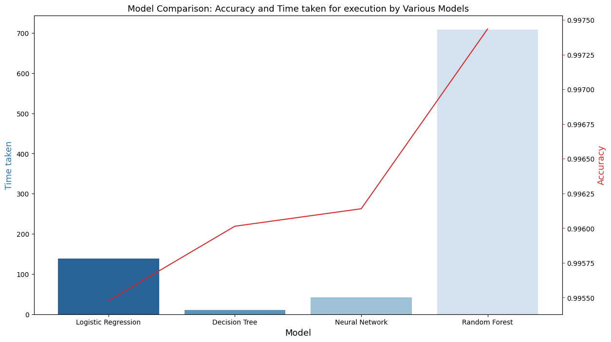

# CSE-475-assignment
 This compares different classification models (Random Forest, Decision tree, Logistic regression, and neural network) on a credit card fraud detection dataset containing more than 1.2 Million rows and 23 columns.
 
 

